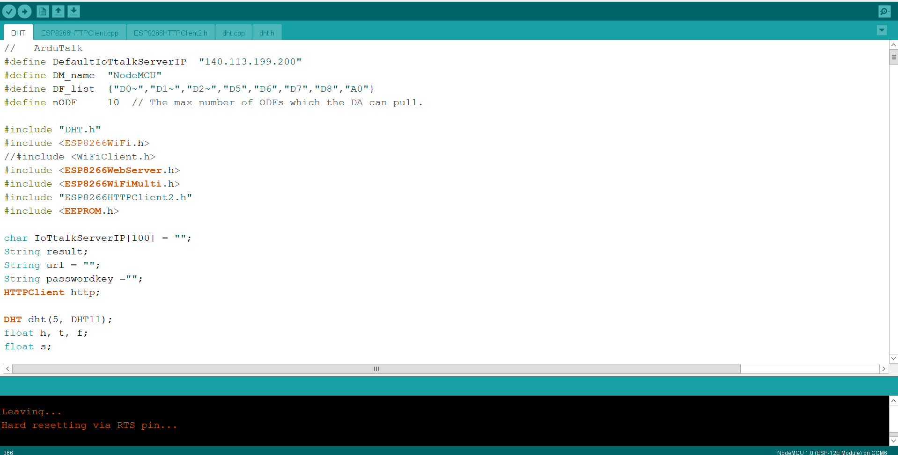

# 2020 NCTU Advanced IoT Final Project
* Topic: United Forecast System

## Requirement
1. linebot
2. chrome driver
3. ngrok
4. NodeMCU + DHT

## Usage
```
ngrok http 5000
python3 bot.py
python3 crawlerDAI.py
# NodeMCU connected to iottalk with DHT
``` 

## Snapshot
1. iottalk connected graph


2. bot.py which connect to line and use gTTS to make sound


3. crawlerDAI.py which send and get data from iottalk and crawl the data from weather report


4. arduino code which is for NodeMCU to collect the temperature, humidity data from DHT and send to iottalk


5. executing result

